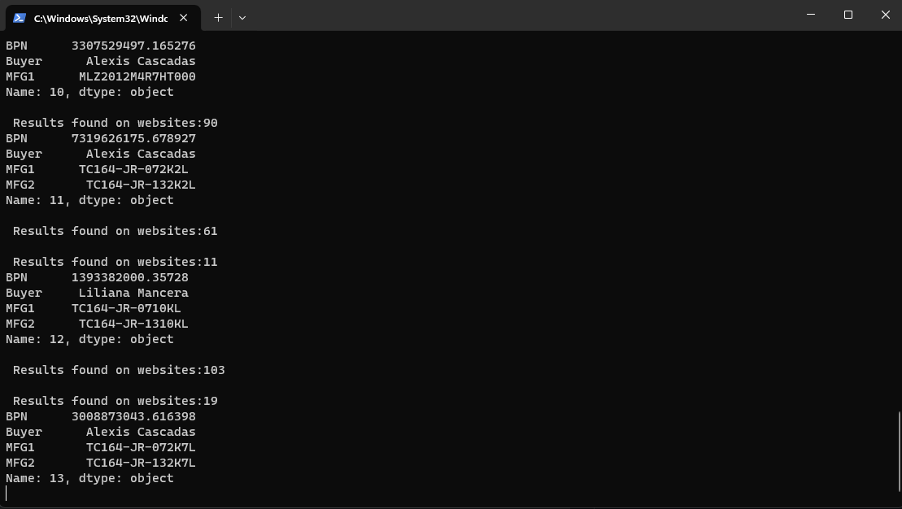

# Automated Pricing Data Retrieval for Parts
## Authors
-  [@gustav0924](https://www.github.com/gustav0924)
## Overview
This project emerged as a pivotal initiative during an internship at Bose, dedicated to advancing supply chain optimization through an automated, Python-based solution. The primary goal was to simplify the process of comparing part prices from internal data with those found on external websites. The project harnessed an Extract, Transform, Load (ETL) process to automate web scraping, using an internal file as a reference. Additionally, the project incorporated features to communicate the results via SMTP using Python modules.

## Tech Stack
- Python
- Windows
- Edge Browser
- Microsoft Edge WebDriver

## Quick glance at the results

| Part #     	                | Manufacturer 	    | Stock        | Distributor         | Website      |  Material  |    Buyer        | Lot Qty      |     Price       |
|-------------------	        |------------------	|------------- |--------------|---------------- |------------ |-------------- |------------| ------------------------------ |
| 30J2R0E      |      Ohmite Mfg Co         |    1        |     Quest Components      |      oemstrade         |    6932656541  |  John K.          |      2500      |      0.56    |

Program result becomes a csv file, example given is an xlsx file.



## Additional Files
Manual sample with STMP module created additionally created to communicate results and a how-to fill the file run the programm

## Repository Structure

```
├── assets
│   ├──  Manual.ipynb                              <- python notebook as manual sample 
│   ├──  stmp.py                                   <- stmp python module 
|
|
├── assets
│   ├──  banner.png                                <- banner file for README
│   ├──  screenshot.png                            <- screenshot sample of program running
│
|
├── datasets
│   ├── 09252023_webdata.xlsx                    <- the dataset created as an xlsx file
│   ├── ListPart.xlsx                            <- the dataset used to extract data and search each material part
│
│
├── LICENSE                                       <- license file.
│
|
├── README.md                                     <- this readme file.

```
